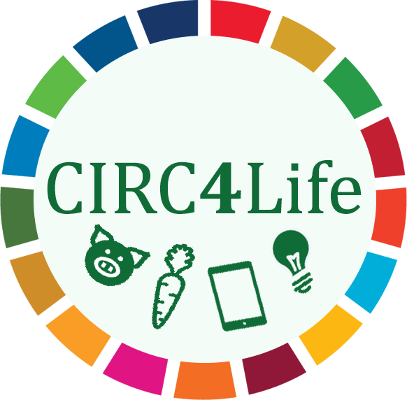

# circ4life-traceability

This is a clone of the Open Api Specifications of the Traceability Module
https://circ4life.eecc.info/doc/oas/ and the EPCIS Eco-Extension https://circ4life.eecc.info/doc/c4l-epcis-extensions.xsd
both of which have been developed within the CIRC4Life project.

## CIRC4Life

This work is part of the CIRC4Life ( https://www.circ4life.eu/ ) project
which received funding from the European Union’s Horizon 2020 research and innovation program under grant agreement No 776503.

## License

 This work is licensed under a <a rel="license" href="http://creativecommons.org/licenses/by-sa/4.0/">Creative Commons Attribution-ShareAlike 4.0 International License</a>.
